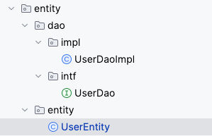
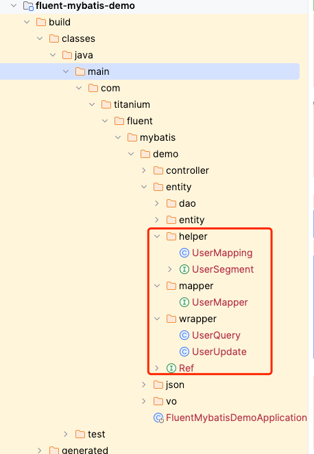

# Fluent-Mybatis

## 快速上手
1. 引入依赖  

maven
```xml
<properties>
    <fluent-mybatis.version>1.8.7</fluent-mybatis.version>
</properties>
<dependencies>
    <!-- 引入fluent-mybatis 运行依赖包, scope为compile -->
    <dependency>
        <groupId>com.github.atool</groupId>
        <artifactId>fluent-mybatis</artifactId>
        <version>${fluent-mybatis.version}</version>
    </dependency>
    <!-- 引入fluent-mybatis-processor, scope设置为provider 编译需要，运行时不需要 -->
    <dependency>
        <groupId>com.github.atool</groupId>
        <artifactId>fluent-mybatis-processor</artifactId>
        <scope>provided</scope>
        <version>${fluent-mybatis.version}</version>
    </dependency>
</dependencies>
```

gradle
```groovy
compile("com.github.atool:fluent-mybatis:${fluentMybatisVersion}")
compileOnly("org.projectlombok:lombok:${lombokVersion}")
compileOnly("com.github.atool:fluent-mybatis-processor:${fluentMybatisVersion}")

// annotation processor配置
annotationProcessor("org.projectlombok:lombok:${lombokVersion}")
annotationProcessor("com.github.atool:fluent-mybatis-processor:${fluentMybatisVersion}")
```

2. 配置代码生成单元测试用例
```java
package com.titanium.fluent.mybatis.demo;

import cn.org.atool.generator.FileGenerator;
import cn.org.atool.generator.annotation.Table;
import cn.org.atool.generator.annotation.Tables;
import org.junit.jupiter.api.Test;
import org.springframework.boot.test.context.SpringBootTest;

@SpringBootTest
class FluentMybatisDemoApplicationTests {
    public static final String url = "jdbc:mysql://rm-bp19352oowkdv76kj.mysql.rds.aliyuncs.com:3306/dev_aigc_server?autoReconnect=true&autoReconnectForPools=true&useUnicode=true&characterEncoding=UTF-8&zeroDateTimeBehavior=CONVERT_TO_NULL&allowMultiQueries=true&useSSL=false&allowPublicKeyRetrieval=true&serverTimezone=Asia/Shanghai";


    @Test
    public void generate() throws Exception {
        FileGenerator.build(Empty.class);
    }

    @Tables(
            // 设置数据库连接信息
            url = url, username = "dev_aigc_server", password = "130d2dhu1HU(kd12OpHU1",
            // 设置entity类生成src目录, 相对于 user.dir
            srcDir = "src/main/java",
            // 设置entity类的package值
            basePack = "com.titanium.fluent.mybatis.demo.entity",
            // 设置dao接口和实现的src目录, 相对于 user.dir
            daoDir = "src/main/java",
            // 设置哪些表要生成Entity文件
            tables = {@Table(value = {"user"})},
            alphabetOrder = false,
            isSetterChain = true,
            isLombok = true,
            logicDeleted = "is_deleted",
            gmtCreated = "created_time",
            gmtModified = "revised_time"
    )
    static class Empty {
    }

}
```

3. 执行单元测试，代码生成  


4. 执行编译流程
执行编译流程后，会编译出一些流程中要用到的类，例如mapper等  


5. 配置声明  
```java
    @Bean
    public MapperFactory mapperFactory() {
        return new MapperFactory();
    }
```