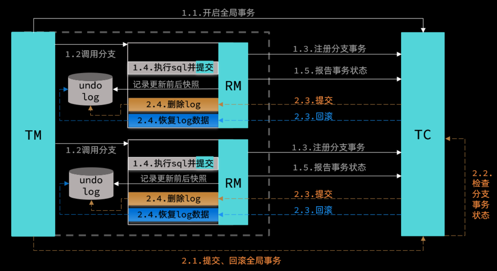

# AT 模式

### 简介

AT模式是Seata的默认事务模式，在Seata中，AT模式是指**自动提交**。  
AT模式是以两段提交的方式实现的，与XA不同的是，AT会自动提交事务，不需要手动提交，而XA需要手动提交事务。  
性能比XA模式高，缺点是数据并非强一致性，而是最终一致性。  


#### 限制
- 仅支持本地事务
- 数据表必须定义主键
- 隔离性：读未提交

### 快速开始

1. 增加undo_log表
在各业务库中增加undo_log表，用于存储回滚日志。
```mysql
-- 注意此处0.7.0+ 增加字段 context
CREATE TABLE `undo_log` (
  `id` bigint(20) NOT NULL AUTO_INCREMENT,
  `branch_id` bigint(20) NOT NULL,
  `xid` varchar(100) NOT NULL,
  `context` varchar(128) NOT NULL,
  `rollback_info` longblob NOT NULL,
  `log_status` int(11) NOT NULL,
  `log_created` datetime NOT NULL,
  `log_modified` datetime NOT NULL,
  PRIMARY KEY (`id`),
  UNIQUE KEY `ux_undo_log` (`xid`,`branch_id`)
) ENGINE=InnoDB AUTO_INCREMENT=1 DEFAULT CHARSET=utf8;
```

2. 配置数据源
   使用AT模式，需要配置数据源代理，使用`DataSourceProxy`，示例如下：

```java
    /**
 * 代理数据源
 * 用于Seata
 * @param datasourceProperties
 * @return
 */
@Bean
@ConditionalOnClass(DataSourceProxy.class)
public DataSourceProxy dataProxy(DataSourceProperties datasourceProperties) {
    log.info("datasource proxy enabled");
    HikariDataSource dataSource = new HikariDataSource();
    dataSource.setJdbcUrl(datasourceProperties.getUrl());
    dataSource.setDriverClassName(datasourceProperties.getDriverClassName());
    dataSource.setUsername(datasourceProperties.getUsername());
    dataSource.setPassword(datasourceProperties.getPassword());
    return new DataSourceProxy(dataSource);
}
```

3. 配置Seata  
   data-source-proxy-mode: AT 是关键，表示使用AT模式，默认是AT模式。

```yml
#连接seata
seata:
  tx-service-group: default_tx_group
  config:
    type: nacos
    nacos:
      server-addr: 127.0.0.1:8848
      group: titanium
      namespace: dev
      username: titanium
      password: marco520
  registry:
    # support: nacos, eureka, redis, zk, consul, etcd3, sofa
    type: nacos
    nacos:
      application: seata-server
      server-addr: 127.0.0.1:8848
      group: titanium
      namespace: dev
      username: titanium
      password: marco520
      client-application: ${spring.application.name}
  data-source-proxy-mode: AT
  client:
    rm:
      report-success-enable: true
      lock:
        retry-interval: 10
        retry-times: 30
      async-commit-buffer-limit: 1000
      table-meta-check-enable: true
    tm:
      default-global-transaction-timeout: 6000
  enable-auto-data-source-proxy: true
```

4. 代码中添加注解