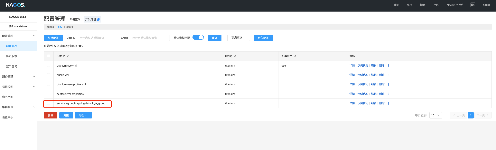

# Titanium-Seata
- 提供TCC悬挂，空回滚的统一逻辑，使用Mysql持久化
- 提供三阶段用户信息的自动包装

### 概念
如果对分布式事务还不熟悉，可以先看看概念，[点这里](distribution-transactional.md)

### 快速开始
#### 1.配置文件
需要在 application.yml 配置文件中添加seata的配置，如下：
```yaml
#连接seata
seata:
  tx-service-group: default_tx_group
  config:
    type: nacos
    nacos:
      server-addr: 127.0.0.1:8848
      group: titanium
      namespace: dev
      username: titanium
      password: marco520
  registry:
    # support: nacos, eureka, redis, zk, consul, etcd3, sofa
    type: nacos
    nacos:
      application: seata-server
      server-addr: 127.0.0.1:8848
      group: titanium
      namespace: dev
      username: titanium
      password: marco520
      client-application: ${spring.application.name}
```

#### 2.配置服务组
需要在nacos中配置服务组，如上面的配置文件中配置了 seata.tx-service-group: default_tx_group，  
则需要在nacos中配置 名为 service.vgroupMapping.default_tx_group 的配置，  

配置内容如下：只需要指定seata-server 的 集群名，在配置 seata-server 服务的时候需要指定集群名
```text
default
```


