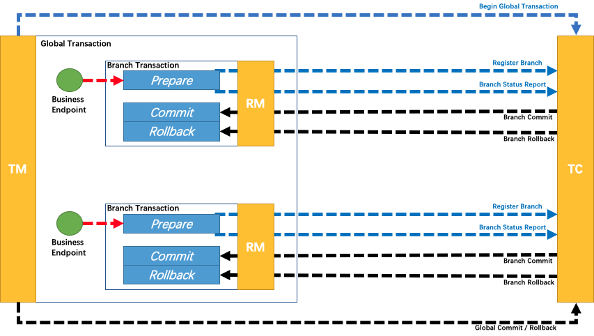

# TCC模式

### 简介
TCC模式（Try-Confirm-Cancel）是一种补偿型事务模式，TCC模式分为三个阶段：
- Try阶段：尝试执行，锁定相关资源。
- 确认阶段：执行具体的业务逻辑，并更新资源状态。
- 取消阶段：取消业务逻辑，释放资源。


### 优点
- 更细粒度的控制，更强的灵活性。
- 对于复杂业务，可以提供更强地控制和确定性。
- 强一致性，能够保证在分布式环境下跨服务操作的原子性和一致性。
- 可减少长事务，提升系统可用性。

### 缺点
- 业务入侵性强，需要实现三个接口，开发成本高，维护成本高。
- 复杂性高，需要考虑资源悬挂，空回滚，幂等性等问题。
- 性能问题，TCC模式需要额外维护Confirm和Cancel两个阶段，会带来额外的性能开销。
- 资源锁定时间长，TCC模式需要锁住资源，如果业务处理时间很长，会导致资源被长时间占用。

### 适用场景
- 银行、金融、电商等领域的关键交易系统
- 性能敏感的核心业务

### 快速开始
1. 配置seata
```yaml
#连接seata
seata:
  tx-service-group: default_tx_group
  config:
    type: nacos
    nacos:
      server-addr: 127.0.0.1:8848
      group: titanium
      namespace: dev
      username: titanium
      password: marco520
  registry:
    # support: nacos, eureka, redis, zk, consul, etcd3, sofa
    type: nacos
    nacos:
      application: seata-server
      server-addr: 127.0.0.1:8848
      group: titanium
      namespace: dev
      username: titanium
      password: marco520
      client-application: ${spring.application.name}
```

2. 添加依赖
```groovy
api "com.alibaba.cloud:spring-cloud-starter-alibaba-seata:${seataVersion}"
```

3.TM 开启TCC 全局事务
```java
    /**
     * 创建用户
     * @param req
     * @return
     */
    @Override
    @GlobalTransactional
    public void createUserWithGT(UserCreateReq req) {
        //本地RM准备方法
        boolean prepare = userCreateAction.prepare(null, req);
        Assert.isTrue(prepare, "创建用户失败,用户已存在");
        //其他RM准备方法接口
        UserInnerCreateReq userInnerCreateReq = UserAssembler.toInnerReq(req);
        Response<Void> response = userClient.create(userInnerCreateReq);
        Assert.isTrue(response.isSuccess(), "user-sso-service 创建用户失败");
    }
```

4.RM 写法
```java
package com.titanium.user.profile.service.tcc.impl;

import cn.hutool.core.lang.Assert;
import cn.hutool.core.util.ObjectUtil;
import com.titanium.common.user.UserContext;
import com.titanium.common.user.UserContextHolder;
import com.titanium.json.Json;
import com.titanium.user.profile.common.user.req.UserCreateReq;
import com.titanium.user.profile.common.user.resp.UserDetailResp;
import com.titanium.user.profile.service.assembler.UserAssembler;
import com.titanium.user.profile.service.entity.User;
import com.titanium.user.profile.service.repository.UserRepository;
import com.titanium.user.profile.service.tcc.ResultHolder;
import com.titanium.user.profile.service.tcc.UserProfileCreateAction;
import io.seata.core.context.RootContext;
import io.seata.rm.tcc.api.BusinessActionContext;
import io.seata.rm.tcc.api.BusinessActionContextParameter;
import io.seata.rm.tcc.api.LocalTCC;
import io.seata.rm.tcc.api.TwoPhaseBusinessAction;
import lombok.AllArgsConstructor;
import lombok.extern.slf4j.Slf4j;
import org.springframework.stereotype.Service;
import org.springframework.transaction.annotation.Transactional;

@Slf4j
@Service
@AllArgsConstructor
//虽然这个注解可以传递给子类，但是建议不要在父类使用这个注解
@LocalTCC
public class UserProfileCreateActionImpl implements UserProfileCreateAction {
    private final UserRepository userRepository;

    /**
     * 准备阶段
     * @param context
     * @param req
     * @return
     */
    @Override
    @TwoPhaseBusinessAction(name = "UserProfileCreateAction", commitMethod = "commit", rollbackMethod = "rollback")
    @Transactional(rollbackFor = Exception.class)
    public boolean prepare(BusinessActionContext context, @BusinessActionContextParameter(paramName = "req") UserCreateReq req) {
        String xid = context.getXid();
        if (ResultHolder.userCreateResultGet(xid) != null) {
            log.info("xid {} already exec, status {}", xid, ResultHolder.userCreateResultGet(xid));
            return false;
        }
        log.info("UserProfileCreateAction prepare, xid: {}, req: {}", xid, Json.serialize(req));
        try {
            User user = userRepository.getByMobile(req.getMobile());
            ResultHolder.userCreateResultPut(xid, ResultHolder.PREPARE_RESULT);
            context.addActionContext("req", Json.serialize(req));
            context.addActionContext("user_context", Json.serialize(UserContextHolder.get()));
            return ObjectUtil.isNull(user);
        } catch (Exception e) {
            log.error(e.getMessage(), e);
            return false;
        }
    }

    /**
     * 提交阶段
     * @param context
     * @return
     */
    @Override
    @Transactional(rollbackFor = Exception.class)
    public boolean commit(BusinessActionContext context) {
        try {
            String xid = context.getXid();
            Assert.isTrue(context.getActionContext("req") != null);
            log.info("UserProfileCreateAction commit, xid: {}, req: {}", xid, Json.serialize(context.getActionContext("req")));
            UserContext userContext = Json.deserialize((String) context.getActionContext("user_context"), UserContext.class);
            UserContextHolder.set(userContext);
            UserCreateReq req = Json.deserialize((String) context.getActionContext("req"), UserCreateReq.class);
            User user = UserAssembler.toEntity(req);
            boolean saved = userRepository.save(user);
            Assert.isTrue(saved, "创建用户失败");
            UserDetailResp detailResp = UserAssembler.toDetailResp(user);
            Assert.isTrue(ObjectUtil.isNotNull(detailResp));
            Assert.notNull(detailResp.getUserId());
            return true;
        } catch (Exception e) {
            log.error(e.getMessage(), e);
            throw e;
        } finally {
            if (UserContextHolder.get() != null) {
                UserContextHolder.clear();
            }
        }
    }

    /**
     * 回滚阶段
     * @param context
     * @return
     */
    @Override
    @Transactional(rollbackFor = Exception.class)
    public boolean rollback(BusinessActionContext context) {
        String xid = context.getXid();
        if (ResultHolder.userCreateResultGet(context.getXid()) != ResultHolder.PREPARE_RESULT) {
            log.info("xid {} empty roll back", xid);
            return true;
        }
        Assert.isTrue(context.getActionContext("req") != null);
        log.info("UserProfileCreateAction rollback, xid: {}, req: {}", xid, Json.serialize(context.getActionContext("req")));
        UserCreateReq req = Json.deserialize((String) context.getActionContext("req"), UserCreateReq.class);
        boolean deleted = userRepository.deleteByMobile(req.getMobile());
        return deleted;
    }
}
```

