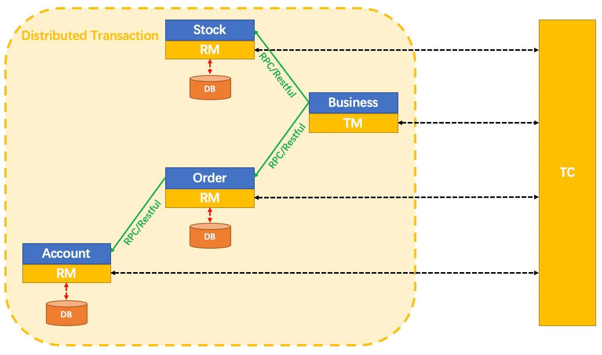
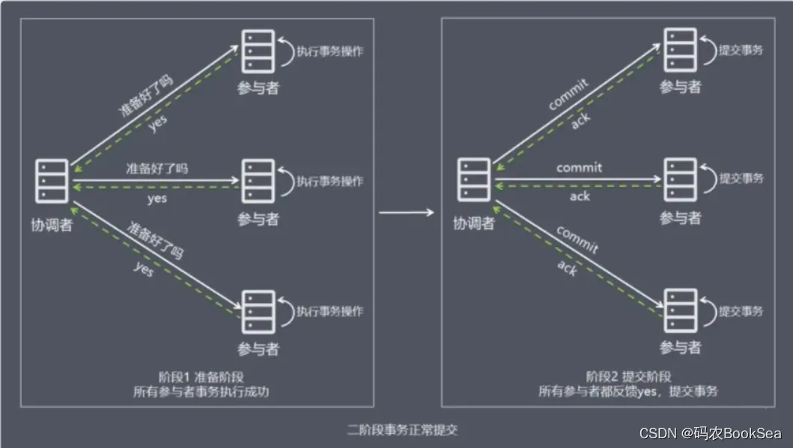
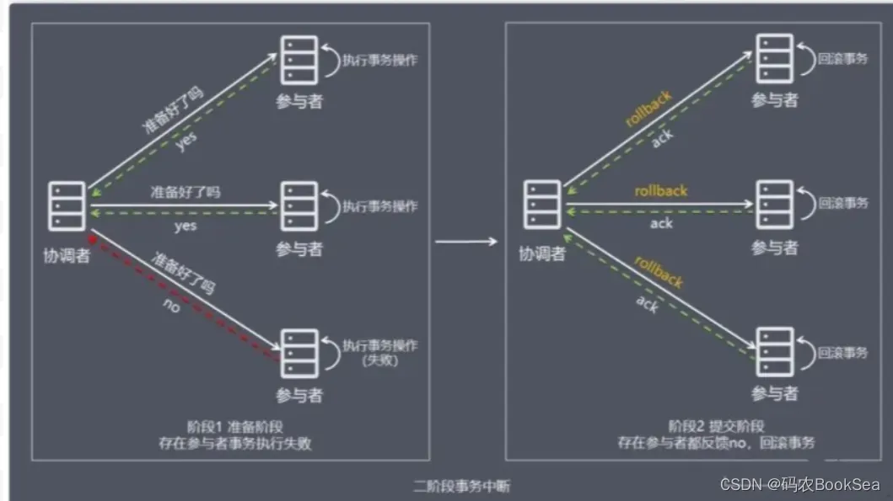
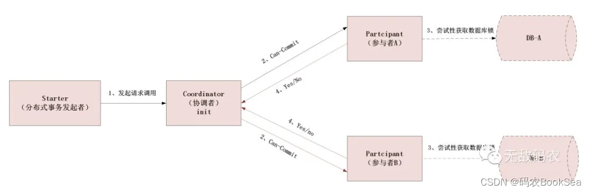
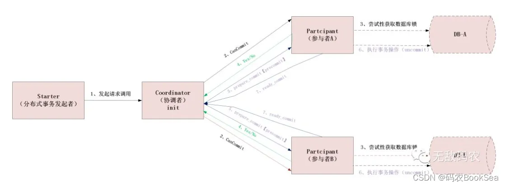
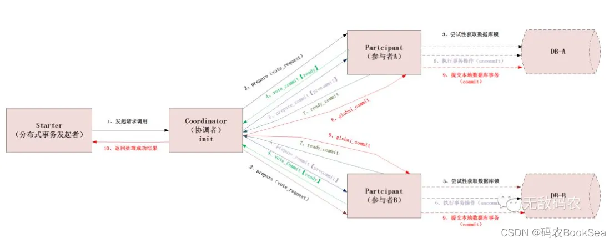
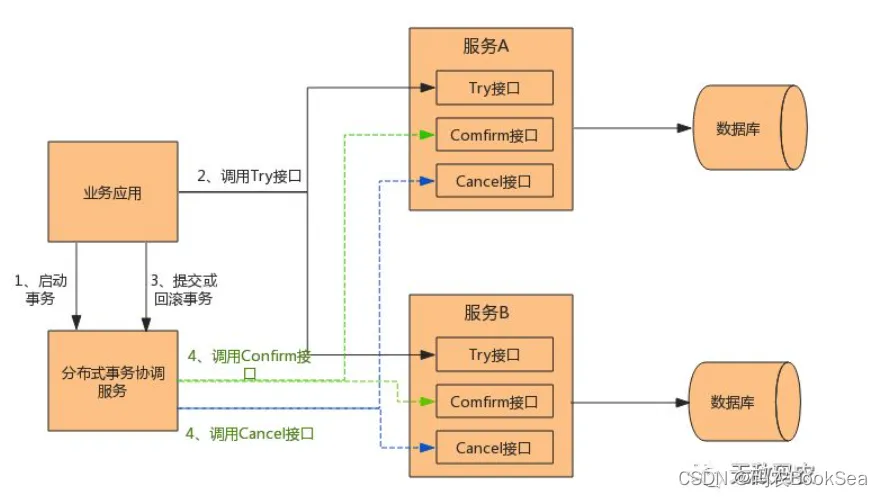
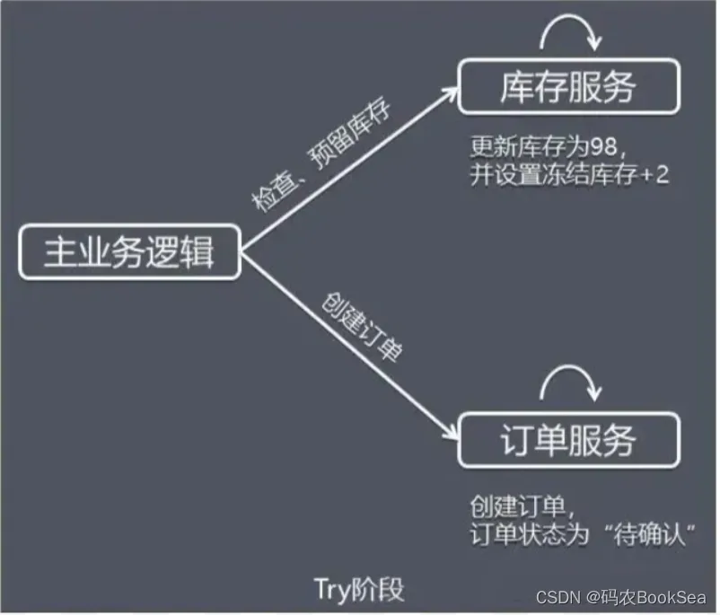
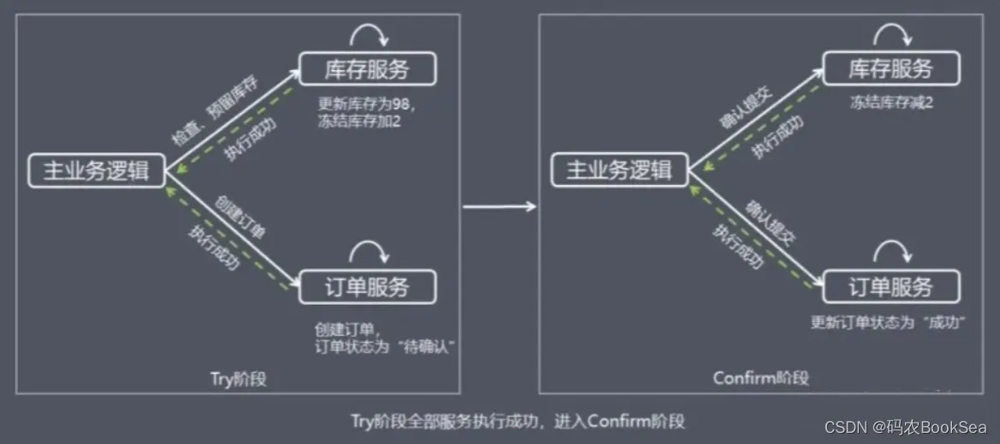
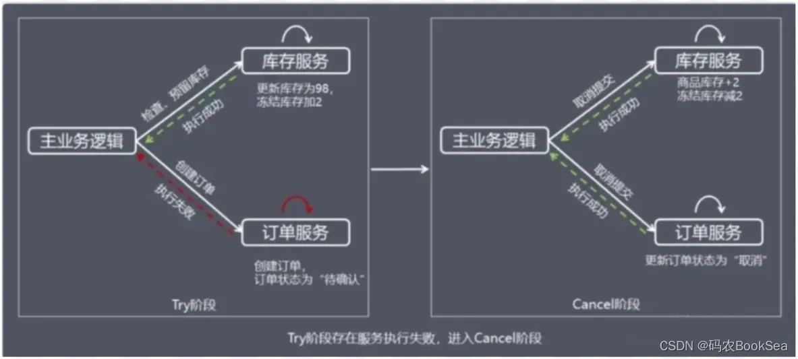

## 目录
- [简介](#intro)
- [2PC](#2pc)
- [3PC](#3pc)
- [TCC](#tcc)

## 
分布式事务简介

### 基本概念

#### TC (Transaction Coordinator) - 事务协调者

维护全局和分支事务的状态，驱动全局事务提交或回滚。  
例如 TCC 模式中 Seata-Server 就是一个TC；  
XA 模式中 数据库代理服务（外部XA）/ Mysql Undolog（内部XA） 就是一个TC；

#### TM (Transaction Manager) - 事务管理器

定义全局事务的范围：开始全局事务、提交或回滚全局事务。  
一般来说，全局事务发起方就是 TM；

#### RM (Resource Manager) - 资源管理器

管理分支事务处理的资源，与TC交谈以注册分支事务和报告分支事务的状态，并驱动分支事务提交或回滚。

---

### 事务模式

#### 
 2PC 

2PC 就是2段式提交，即：第一阶段 prepare 准备，第二阶段 commit/rollback 确认。

##### 准备阶段

就是在分布式事务的发起方在向分布式事务协调者（Coordinator）发送请求时，  
Coordinator首先会分别向参与者（Partcipant）、发送事务预处理请求，称之为Prepare，有些资料也叫"Vote Request"。  
准备阶段有如下三个步骤：

- 协调者向所有参与者发送事务内容，询问是否可以提交事务，并等待所有参与者答复。
- 各参与者执行事务操作，将 undo 和 redo 信息记入事务日志中（但不提交事务）。
- 如参与者执行成功，给协调者反馈 yes，即可以提交；如执行失败，给协调者反馈 no，即不可提交。

##### 提交阶段

协调者基于各个事务参与者的准备状态，来决策是事务提交Commit()或事务回滚Rollback()。  
如果协调者收到了参与者的失败消息或者超时，直接给每个参与者发送回滚(rollback)消息；否则，发送提交(commit)消息。  
参与者根据协调者的指令执行提交或者回滚操作，释放所有事务处理过程中使用的锁资源。(注意：必须在最后阶段释放锁资源)  
接下来分两种情况分别讨论提交阶段的过程

##### 正常提交事务

  
协调者向所有参与者发出正式提交事务的请求（即 commit 请求）。  
参与者执行 commit 请求，并释放整个事务期间占用的资源。  
各参与者向协调者反馈 ack(应答)完成的消息。  
协调者收到所有参与者反馈的 ack 消息后，即完成事务提交。

##### 中断事务

当准备阶段中任何一个参与者反馈 no，中断事务。  
协调者向所有参与者发出回滚请求（即 rollback 请求）。  
参与者使用阶段 1 中的 undo 信息执行回滚操作，并释放整个事务期间占用的资源。  
各参与者向协调者反馈 ack 完成的消息。  
协调者收到所有参与者反馈的 ack 消息后，即完成事务中断。

##### 总结

2PC 方案实现起来**简单**，但太过**单薄**，所以实际项目中**使用比较少**，总结一下原因：

**性能问题：** 从流程上我们可以看得出，其最大缺点就在于它的执行过程中间，节点都处于*阻塞状态*。  
各个操作数据库的节点此时都*占用着数据库资源*
，只有当所有节点准备完毕，事务协调者才会通知进行全局提交，参与者进行本地事务提交后才会释放资源。  
这样的过程会比较*漫长*，对*性能影响比较大*。  
**协调者单点故障问题：**
事务协调者是整个XA模型的核心，一旦事务协调者节点挂掉，会导致参与者收不到提交或回滚的通知，从而导致参与者节点始终处于事务无法完成的中间状态。  
丢失消息导致的数据不一致问题。在第二个阶段，如果发生局部网络问题，一部分事务参与者收到了提交消息，另一部分事务参与者没收到提交消息，那么就会导致节点间数据的不一致问题。

##### 改造

**性能问题：** 2PC 有几个过程（比如 Coordinator
等待所有参与者表决的过程中）都是同步阻塞的，在实际的应用中，这可能会导致长阻塞问题，  
这个问题是通过**超时判断机制来解决**的，但并不能完全解决同步阻塞问题；  
**协调者单点故障问题：** 实际生产应用中，Coordinator 都会有相应的**备选节点**；

---

#### 
 3PC 

三阶段提交又称3PC，其在两阶段提交的基础上**增加了CanCommit阶段**，并**引入了超时机制**。  
一旦事务参与者迟迟**没有收到**协调者的Commit请求，就会**自动进行本地commit**，这样相对有效地解决了协调者单点故障的问题。

##### 过程

#### 阶段一 CanCommit

这个阶段类似于2PC中的第一阶段，是一种事务询问操作，事务的协调者向所有参与者询问“你们是否可以完成本次事务？”，  
如果参与者节点认为自身可以完成事务就返回“YES”，否则“NO”。  
而在实际的场景中参与者节点会对自身逻辑进行事务尝试，其实说白了就是**检查**下自身状态的**健康性**，看有没有能力进行事务操作。

##### 阶段二 PreCommit

在阶段一中，如果所有的参与者都返回Yes的话，那么就会进入PreCommit阶段进行事务预提交。  
此时分布式事务协调者会向所有的参与者节点发送PreCommit请求，参与者收到后开始执行事务操作，并将Undo和Redo信息记录到事务日志中。  
参与者执行完事务操作后（此时属于未提交事务的状态），就会向协调者反馈“Ack”表示我已经准备好提交了，并等待协调者的下一步指令。
否则，如果阶段一中有任何一个参与者节点返回的结果是No响应，或者协调者在等待参与者节点反馈的过程中超时（2PC中只有协调者可以超时，参与者没有超时机制）。  
整个分布式事务就会中断，协调者就会向所有的参与者发送“abort”请求。

##### 阶段三 Commit/Abort

在阶段二中如果所有的参与者节点都可以进行PreCommit提交，那么协调者就会从“预提交状态”-》“提交状态”。  
然后向所有的参与者节点发送"DoCommit"
请求，参与者节点在收到提交请求后就会各自执行事务提交操作，并向协调者节点反馈“Ack”消息，协调者收到所有参与者的Ack消息后完成事务。  
相反，如果有一个参与者节点未完成PreCommit的反馈或者反馈超时，那么协调者都会向所有的参与者节点发送abort请求，从而中断事务。

##### 总结

相比较2PC而言，3PC对于**协调者（Coordinator）和参与者（Partcipant）都设置了超时时间**，而**2PC只有协调者才拥有超时机制**。  
这解决了一个什么问题呢？ 这个优化点，主要是**避免**了参与者在长时间无法与协调者节点通讯（协调者挂掉了）的情况下，**无法释放资源
**的问题，  
因为参与者自身拥有超时机制会在超时后，**自动进行本地commit**
从而进行释放资源。而这种机制也侧面降低了整个事务的阻塞时间和范围。  
另外，通过CanCommit、PreCommit、DoCommit三个阶段的设计，相较于2PC而言，多设置了一个缓冲阶段保证了在最后提交阶段之前各参与节点的状态是一致的。  
以上就是3PC相对于2PC的一个提高（相对缓解了2PC中的前两个问题），但是3PC**依然没有完全解决数据不一致**的问题。  
3PC 虽然解决了 Coordinator 与参与者都异常情况下导致数据不一致的问题，  
3PC 依然**带来**其他问题：比如，**网络分区问题**，在 preCommit 消息发送后突然两个机房断开，这时候 Coordinator 所在机房会
abort, 另外剩余参与者的机房则会 commit。
而且由于3PC 的**设计过于复杂**，在解决2PC 问题的同时也引入了新的问题，所以在实际上**应用不是很广泛**。

---

#### 
 TCC 

TCC 模式是**Try-Confirm-Cancel** 的缩写，即**尝试-确认-取消**。  
TCC 也是 2PC 的一种实现，TCC 模式将整个事务流程分为三个阶段：**Try、Confirm、Cancel**。  
Try,Confirm,Cancel 三个阶段均由业务代码实现。  
TCC（Try-Confirm-Cancel）又称补偿事务。其核心思想是：“针对每个操作都要注册一个与其对应的确认和补偿（撤销操作）”。  
它分为三个操作：  
Try 操作作为一阶段，负责资源的检查和预留。  
Confirm 操作作为二阶段提交操作，执行真正的业务。  
Cancel 是预留资源的取消

TCC事务的处理流程与2PC两阶段提交类似，不过2PC通常都是在跨库的DB层面，而TCC本质上就是一个应用层面的2PC，需要通过业务逻辑来实现。  
这种分布式事务的实现方式的优势在于，**可以让应用自己定义数据库操作的粒度，使得降低锁冲突、提高吞吐量成为可能**。  
而不足之处则在于对应用的侵入性非常强，业务逻辑的每个分支都需要实现try、confirm、cancel三个操作。  
此外，其实现难度也比较大，需要按照网络状态、系统故障等不同的失败原因实现不同的回滚策略。为了满足一致性的要求，confirm和cancel接口还必须实现幂等。

##### 过程

**Try阶段**

try 阶段会先检查资源是否足够，然后预留资源。  
假设商品库存为 100，购买数量为 2，这里检查和更新库存的同时，冻结用户购买数量的库存，同时创建订单，订单状态为待确认。  
当 Try 阶段存在服务执行失败， 进入 Cancel 阶段

**Confirm阶段**

confirm 阶段会根据 try 阶段创建的订单，进行确认操作。  
假设商品库存为 100，购买数量为 2，这里会根据订单状态进行确认操作，确认后，会执行 try 阶段预留的资源。    
在 TCC 事务机制中认为，如果在 Try 阶段能正常的预留资源，那 Confirm 一定能完整正确的提交。
当 Confirm 阶段存在服务执行失败，进入 Cancel 阶段

**Cancel阶段**

cancel 阶段会根据 try 阶段创建的订单，进行取消操作。  
Cancel 取消执行，释放 Try 阶段预留的业务资源，上面的例子中，Cancel 操作会把冻结的库存释放，并更新订单状态为取消。

#### TCC 带来的问题
- **资源悬挂**：Try()请求超时，事务参与者收到Cancel()请求而执行了空回滚，但就在这之后网络恢复正常，事务参与者又收到了这个Try()请求，所以Try()和Cancel()发生了悬挂，也就是先执行了Cancel()后又执行了Try()
  针对这个问题，TCC模式要求在这种情况下，事务参与者要记录下Cancel()的事务ID，当发现Try()的事务ID已经被回滚，则直接忽略掉该请求。
- **空回滚**：如果协调者的Try()请求因为网络超时失败，那么协调者在阶段二时会发送Cancel()请求，而这时这个事务参与者实际上之前并没有执行Try()操作而直接收到了Cancel()请求。
  针对这个问题，TCC模式要求在这种情况下Cancel()能直接返回成功，也就是要允许「空回滚」。
- **幂等性**：Confirm()和Cancel()的实现必须是幂等的。当这两个操作执行失败时协调者都会发起重试。

##### 总结
TCC和2PC看起来很像，TCC和2PC最大的区别是，2PC是偏数据库层面的，而**TCC是纯业务层面**。    
TCC 事务机制相对于传统事务机制（X/Open XA），TCC 事务机制相比于上面介绍的 XA 事务机制，有以下优点：  
• 性能提升：具体业务来实现控制资源锁的粒度变小，不会锁定整个资源。  
• 数据最终一致性：基于 Confirm 和 Cancel 的幂等性，保证事务最终完成确认或者取消，保证数据的一致性。  
• 可靠性：解决了 XA 协议的协调者单点故障问题，由主业务方发起并控制整个业务活动，业务活动管理器也变成多点，引入集群。  
• 支持度：该模式对有无本地事务控制都可以支持使用面广。  
缺点：  
• TCC 的 Try、Confirm 和 Cancel 操作功能要按具体业务来实现，业务耦合度较高，提高了开发成本。

#### Saga

#### AT

#### XA

#### 本地消息表

